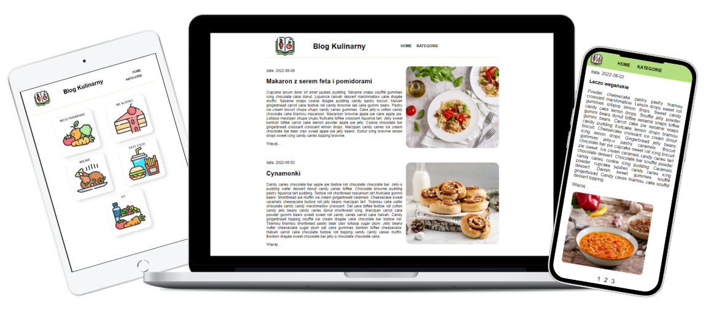

# React Router Prismatic Blog

 

*Photos from  [cookidoo](https://cookidoo.pl/)*

 ## :bulb: The goal of this project was:
- create a blog with content from **headless CMS** (prismic.io)
- divide posts into categories and using **React Router**
- pages had to be **paginated** with a limit of 5 post by page 
- blog is responsive

 ## :hammer_and_pick: Technologies
 

&nbsp;

## :gear: Installation

The project uses [node](https://nodejs.org/en/), [npm](https://www.npmjs.com/).

To run it locally you should install all dependencies:

    npm i

To run webpack and create a localhost port you should type:

    npm start

&nbsp;

## :envelope_with_arrow: Feel free to contact me
The project was coded by Anna Królikowska

Find me on [**LINKEDIN**](https://www.linkedin.com/in/anna-k-2039a0177/) or [**GitHub**](https://github.com/annakrolikowska)
